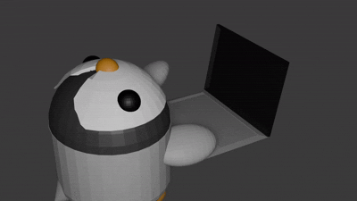

# Hi I'm Mewinator

#### I can code in:


#### I want to learn to code in:
 
 
 
### I sometimes make animations


- My favorite game is Minecraft

### Contact me:
- Email: ```bWV3aW5hdG9yQGdtYWlsLmNvbQ==```
- Discord: ```mewinatorx2```
- Signal: ```Mewinator.01```
