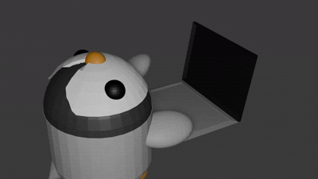
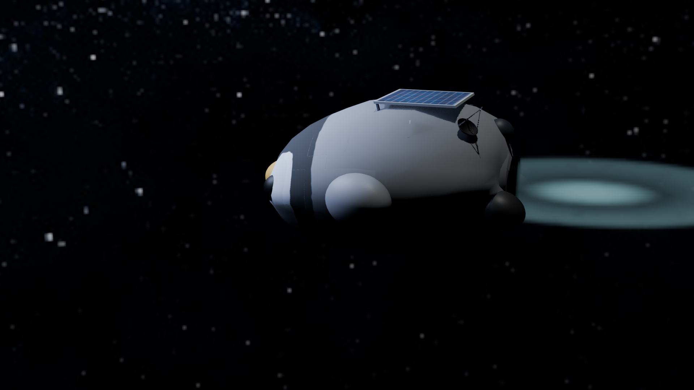

# Hi I'm Mewinator

#### I can code in:
<p>
	<a href="https://skillicons.dev">
		
	</a>
</p>

#### I can also use

<p>
	<a href="https://skillicons.dev">
		
	</a>
</p>

##### But I like Photopea for Photoshop work away from my setup.


### I like to 3d model/animate sometimes



Click image to watch video:

[](/america%20250.mp4)
##### Includes:
- Tap-Tap Pingu
- He Fly
- The most patriotic video ever

##### My favorite game is Minecraft

### Contact me:
- Email: ```bWV3aW5hdG9yQGdtYWlsLmNvbQ==```
- Discord: ```bWV3aW5hdG9yeDI=```
- Signal: ```TWV3aW5hdG9yLjAx```
<p>They all in B64. hehehe</p>
